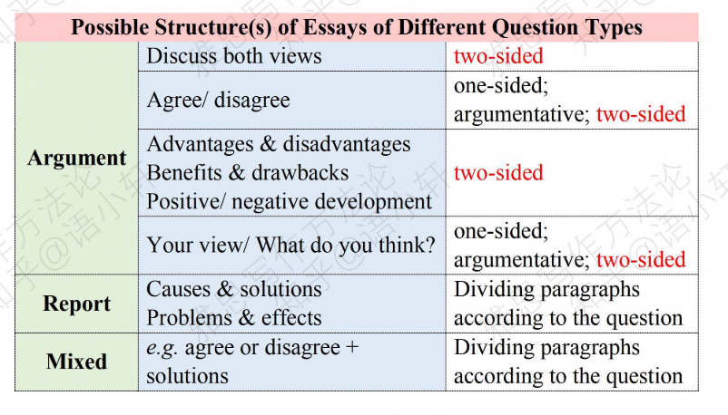

# Day 2

## 审题目，定结构，拟提纲

### 1. Question Type：

1. Argument

   > **Example :** Discuss both views ..../ Do you agree or dis agree ..../ Discuss the advantages and dis advantages of ...  

2. Report 

   > **Example :** What do you think the causes of this?/What solutions can you suggest ?

3. Mixed 
	
   > **Example :** agree this view?+ take what measures?

---

### 2. The Structure of the Task 2 Essays

1. One-sided

   |                    Outline of Paragraphs                     |          Descriptions           |
   | :----------------------------------------------------------: | :-----------------------------: |
   | Introdution  - Body 1(Reason 1+ evidence) - Body 2(Reason 2+ evidence) - Body 3(Reason3+ evidence) Conclusion | Disadv: 2-3 reasons are needed. |

2. Argumentative 

|                    Outline of Paragraphs                     |                         Descriptions                         |
| :----------------------------------------------------------: | :----------------------------------------------------------: |
| Introdution  <mark>Concession & rebuttal paragraph</mark> - Body 1(Reason 1+ evidence) - Body 2(Reason 2+ evidence) Conclusion | Adv:  1. Easily meet the min word requirement 2. Be more balanced and objective |

3. Two sided

   |                    Outline of Paragraphs                     |                         Descriptions                         |
   | :----------------------------------------------------------: | :----------------------------------------------------------: |
   | Introdution  - Body para 1(for)+ reasons - Body para 2(against)+reasons Conclusion | Adv:  1. Easily meet the min word requirement 2. Easy to develop ideas. |

?> How to use ?

> 

### 3. How to examine the question?

Agree or Disagree

事实判断(fact judagement)+价值判断(value judagement)

需要进行判断的是价值判断。

These days, ......(fact) so ....(value).

对于事实判断不应进行过多分析。

### 4. How to write an outline(5 min)？

1. 时间规划

   5min (outline)+ 30min(writing) + 3min(check)

2. Outline

| Thesis statement:         |      |
| ------------------------- | ---- |
| Reason1: Evidence1:  |      |
| Reason2: Evidence2:  |      |
| Reason3:  Evidence3: |      |

3. Steps

   a) Brainstorming for ideas and sketching them on paper.

   !> Dont jump to the conclusion(compare the number of reasons)

   !>Divided the question into specifics.

   > Example: 
   >
   > - Why should we learn art ?
   > - Why should we learn art from a <mark>young age</mark> ?
   > - What <mark>subjects</mark> does arts include ? 
   > - What are the <mark>characteristic</mark> of an art subject ? 

   b) Organising ideas into groups and into arguments.

   !> idea(specific)--->argument(abstract) 将具体例子抽象出来，
   (下义词)carrot-->vegetable-->food-->thing(上义词)

   > Example: 
   >
   > | Rough ideas                                                  | Arguments                                         |
   > | ------------------------------------------------------------ | ------------------------------------------------- |
   > | 我学过美术，画画的时候感觉很愉悦，可以<mark>静下心来，忘记烦恼</mark> | offers mental benefits.                           |
   > | 以前学钢琴，感觉<mark>如坐针毡</mark>                        | bring about pressure                              |
   > | 学小提琴看起来很<mark>酷</mark>                              | may have a sense of  achievement                  |
   > | 可以培养<mark>多方面</mark>能力                              | contribute to children’s all-arounded development |
   >
   > 

   c) Selecting ideas for body paragraphs

   !> 1. Examine the feasibility of your arguments(in English? / well in Englih ?/ present the evidence logically with examples ?)

   !> 2. Examine overlapping or repetition of your arguments   
   
   Is your argument...
   
   >- too general?[incloud other arguments]
   >- too specific[be inclouded]? 
   >- mean basically the same as other arguments?
   
   d) Select your stance on the topic
   
   !> Select the thesis you can easily develop your body paragraphs.
   
   e) Write the topic sentence
   
    

