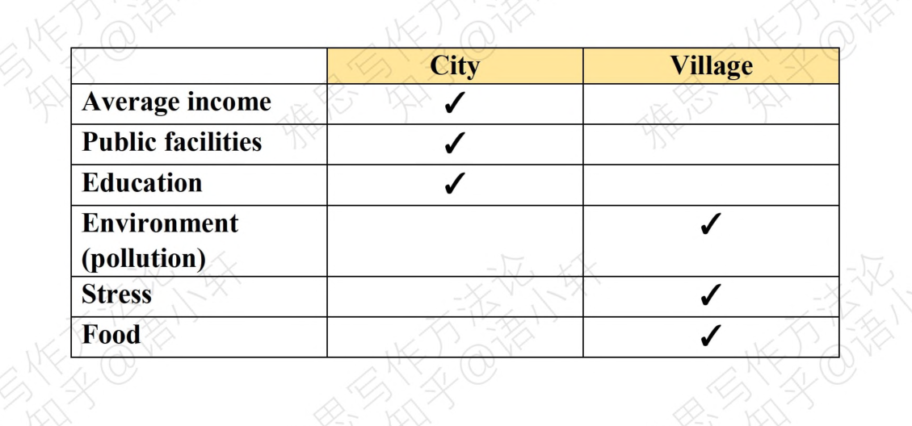
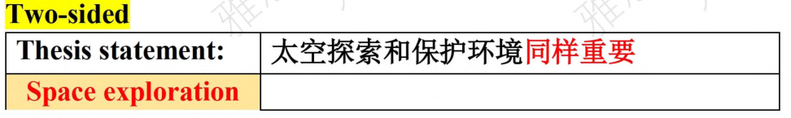
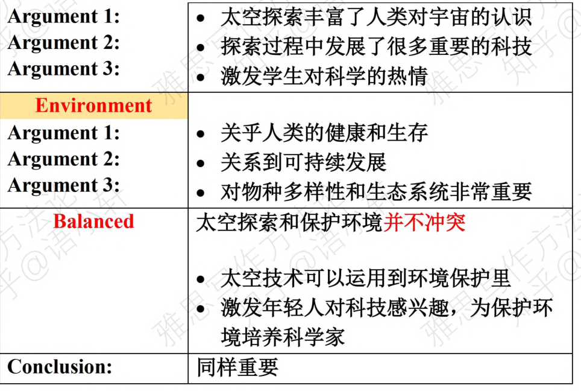

# Day 3

## 特定类型题目思考

### 1.建议类(should, the best way of...,it is important to)

|                           | 支持 for                                                     | 反对 against                                                 |
| ------------------------- | ------------------------------------------------------------ | ------------------------------------------------------------ |
| **必要性 Necessity**      | <mark>Benefits</mark>带来了好处 <mark>Solving problems</mark>解决了实际问题 | <mark>Not necessary</mark>(好处不被特定人需要、好处已有、特定人群没有需求) <mark>Alternative</mark>(可以由更好的方法替代) |
| **风险性Risks**           | <mark>Risk management and Control</mark>(让步段)尽管有这些风险，但可以用这些方法解决。 | <mark>Downsides</mark>有很多弊端 <mark>Counterproductive</mark>起到反效果  |
| **可行性Feasible**        | <mark>Feasible/workable</mark> 有人力物力财力去实施 <mark>Solution to potential challenges</mark> 让步+解决方案 即使有苦难 也可以有方法实施 | <mark>Not feasible</mark> 没有能力知识实施这个方案 特定人群没有能力 |
| **实际效果Actual effect** | <mark>Effective </mark>效果很好 <mark>Acceptable </mark> | <mark>Ineffective</mark> 因为某个原因，未达到设想结果 没有找到问题根本原因，不能解决问题。 <mark>Not worthwhile</mark> 实际收益低 |

> **Example**: 
>
> All university students should take basic science courses regardless of their fields of study.
>
> To what extent do you agree or disagree with this opinion ?

?> List all those items according to the Chart.

|                           | 支持 for                                                     | 反对 against                                                 |
| ------------------------- | ------------------------------------------------------------ | ------------------------------------------------------------ |
| **必要性 Necessity**      | <mark>Benefits</mark>培养抽象化，概念化的理科思维，提高职场竞争力 <mark>Solving problems</mark>科学常识是解决日常问题所必需的 | <mark>Not necessary</mark>很多专业不需要 <mark>Alternative</mark>在初高中已学过 |
| **风险性Risks**           | <mark>Risk management and Control</mark>(让步段)尽管有这些风险，但可以用这些方法解决。 | <mark>Downsides</mark>很难，打击人积极性 <mark>Counterproductive</mark>占用太多时间导致学生没办法完成专业课  |
| **可行性Feasible**        | <mark>Feasible/workable</mark>  <mark>Solution to potential challenges</mark> 学校可以设置相对轻松的课程，可以增强课堂效果，激发学生的学习热情  | <mark>Not feasible</mark> 科学学习不可能变得轻松   |
| **实际效果Actual effect** | <mark>Effective </mark> <mark>Acceptable </mark>        | <mark>Ineffective</mark> 学生被强迫学习，学习效果值得怀疑 <mark>Not worthwhile</mark> 很多教授讲课无聊，实际收益低 |

?> Put them into the passages structure

**a) Two-Sided**

| Thesis statement:                                            | <mark>不同意</mark>学校要求学生学习科学课程                  |
| ------------------------------------------------------------ | ------------------------------------------------------------ |
| **<mark>For</mark> Argument 1： Argument 2：**     |  科学常识是必须的 培养抽象化、概念化的理科思维     |
| **<mark>Against</mark> Argument 1： Argument 2： Argument 3：** |  不必要 让学生学习这些课程有害 课程效果值得怀疑 |
| **Conclusion：**                                             | 不同意                                                       |

!> 文章立场放在较后主体段写，段落长度 Against > For. 

**b) Argumentation**

| Thesis statement:              | <mark>同意</mark>学校要求学生学习科学课程      |
| ------------------------------ | ---------------------------------------------- |
| **Reason 1： Example ：** |  科学常识是必须的                    |
| **Reason 2： Example ：** |  培养抽象化、概念化的理科思维             |
| **Concession: Rebuttal**  | 虽然开科学课很有挑战性 但这些困难可以逾越 |
| **Conclusion：**               | 同意                                           |

**c) One-Side**

| Thesis statement:              | <mark>不同意</mark>学校要求学生学习科学课程                  |
| ------------------------------ | ------------------------------------------------------------ |
| **Reason 1： Example ：** | 不必要 1. 很多专业没有关系 2. 初高中已学过基础课程 |
| **Reason 2： Example ：** | 有害的 1. 打击自信心 2. 占用学习时间               |
| **Reason 3： Example ：** | 课程效果值得怀疑 1. 学生被强迫学习 2.教授无法激发学生热情 |
| **Conclusion：**               | 不同意                                                       |

### 2. 含有绝对词类的题目(all,best,most important,only,now,ban)

?> 1. 优先考虑反对

?> 2. 要写一个让步段(先肯定合理性，再反驳绝对词，说法过于绝对)

> **Example**
>
> The <mark>key</mark> to reducing crime is to have more police patrolling the streets.
>
> To what extent do you agree or disagree with this view?
> What other ways of reducing crime may be effective ?

|                             | Benefits                    | Adverse effects                                   | Alternatives                                                 |
| --------------------------- | --------------------------- | ------------------------------------------------- | ------------------------------------------------------------ |
| Have more police patrolling | 1.震慑犯罪 2. 效果明显 | 1. 网络犯罪无法解决 2.凶手执意要犯罪无法避免 | 1.增加现有警力效果 2.提高犯罪惩罚 3.加装监控摄像头 |

| Thesis statement:             | <mark>不同意</mark>加强警力                    |
| ----------------------------- | ---------------------------------------------- |
| **Concession: Rebuttal** | 承认增加警察有效 不是解决犯罪关键    |
| **Reason 1： Reason2：** | 无法解决网络犯罪 执意要犯罪不能避免       |
| **Alternative**               | 增加警力效果 提高犯罪惩罚 加装摄像头 |
| **Conclusion：**              | 不同意                                         |

### 3. 比较类题目(more than/better/rather than)

> **Example**
>
> Living in city or village, which is better ?

### 4. 不可比较类

> **Example**
>
> Instead of spending money on exploration of outer space. government should spend money on the environment.
>
> To what extent do you agree or disagree with this opinon ?

!> Question: A>B ,                                                                                                                                                                                                       Thesis statement : A=B.

