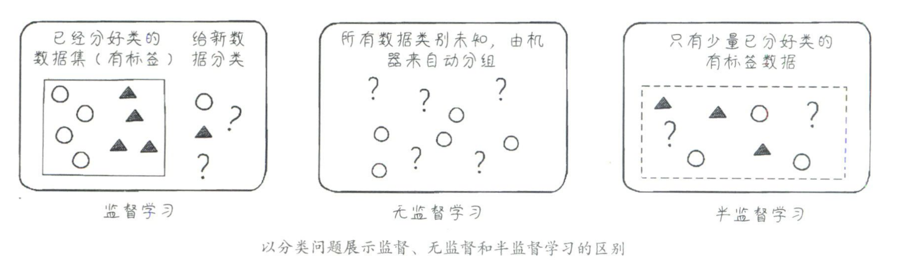
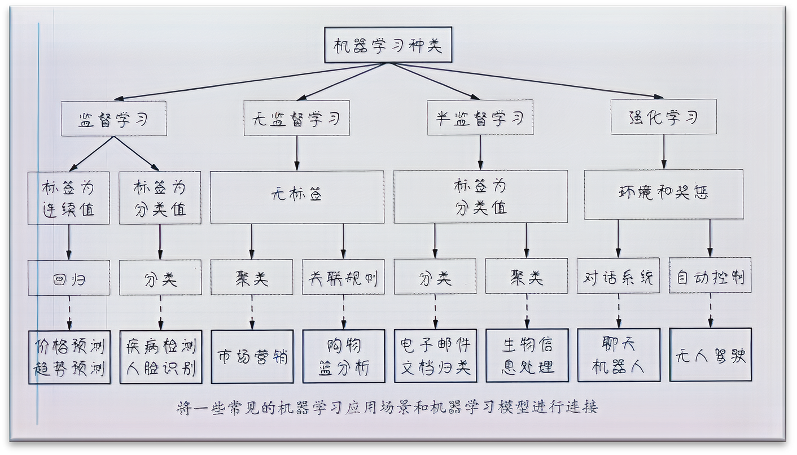
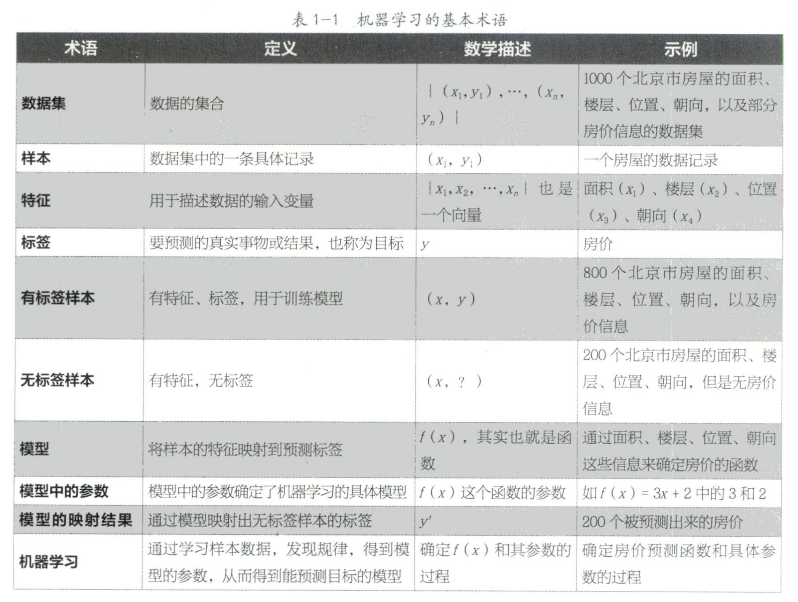
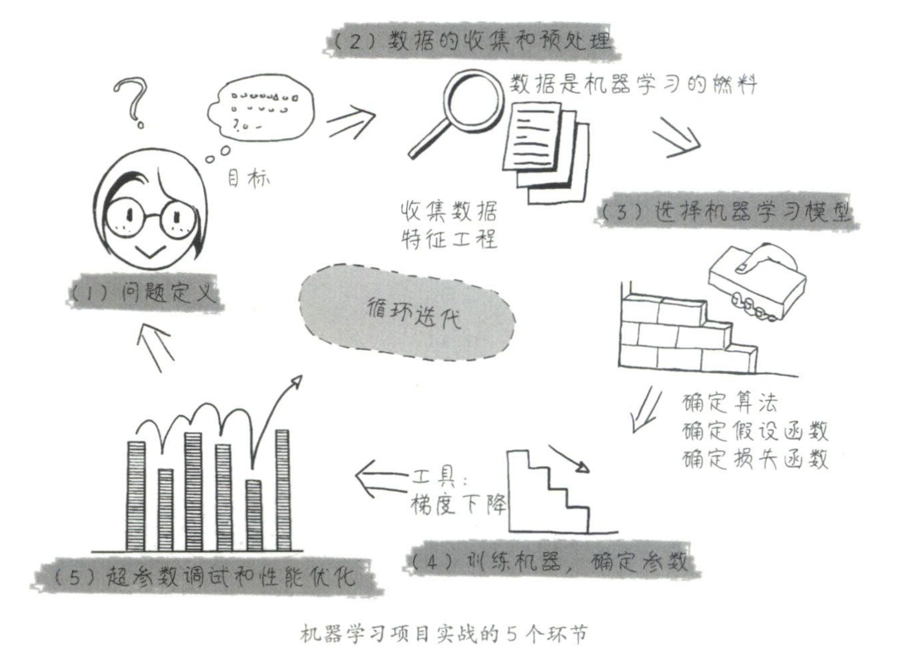

### 机器学习的分类
- 按照训练数据是否有标签，可以分为监督学习，无监督学习和半监督学习，按照学习模型构建方法的不同可以拓展为深度学习（多层神经网络网络）和强化学习（封闭系统空间，通过环境反馈来学习)
- 从解决问题的类型考虑，监督学习可分为分类和回归，无监督学习可分为：聚类，关联规则，以及都有的时间序列和结构化输出
<!-- panels:start -->
<!-- div:floating-cat -->

<!-- panels:end -->
<!-- panels:start -->
<!-- div:floating-cat -->

<!-- panels:end -->

### 基本术语
<!-- panels:start -->
<!-- div:floating-cat -->

<!-- panels:end -->
- 特征：函数中的x向量 

- 标签：函数中的y向量  

- 机器学习模型：f（x）= wx+b（ w为权重，b为偏置称为机器学习的内部参数）

- 损失函数：衡量预测值和真实值差距大小的关于w和b的函数 loss（w，b）

`注意：特征的维度是指1个x向量中元素的个数`

### 机器学习的一般步骤
<!-- panels:start -->
<!-- div:left-panel -->
#### 1. 问题定义
- 对痛点进行定位，解决

#### 2. 数据收集和预处理
- 原始数据准备
	- 网上搜索原始数据集
- 数据预处理
	- 可视化（用Matplotlib和seaborn对数据进行基本了解）
	- 数据向量化（把原始数据处理成机器可读取的形式：文字转为独热编码，文本类别   转为数字）
	- 处理坏数据和缺失值
	- 特征缩放和数据标准化（把数据处理到一个统一的尺度区间，例如[0,1]）和规范化(采用一些手段时将离群数据的影响降低)
- 原则标准
	- 全部为数字格式，大范围数据要压缩到小范围，同一特征的数据类型尽量相同
- 特征工程和特征提取（去掉无关特征，保留最有用的特征）

#### 3. 模型的选取

   

#### 4. 训练机器，确定参数（内部参数）

#### 5. 超参数调试和性能优化
- 损失函数可以评估机器模型的精确性
- 还有其他验证指标
- 如利用：试验集，测试集，和验证集进行检测数据少时用K折检测并对模型进行优化和泛化

<!-- div:right-panel -->

<!-- panels:end -->

### 参考资料
[零基础学机器学习](https://book.douban.com/subject/35264202/"机器学习")

